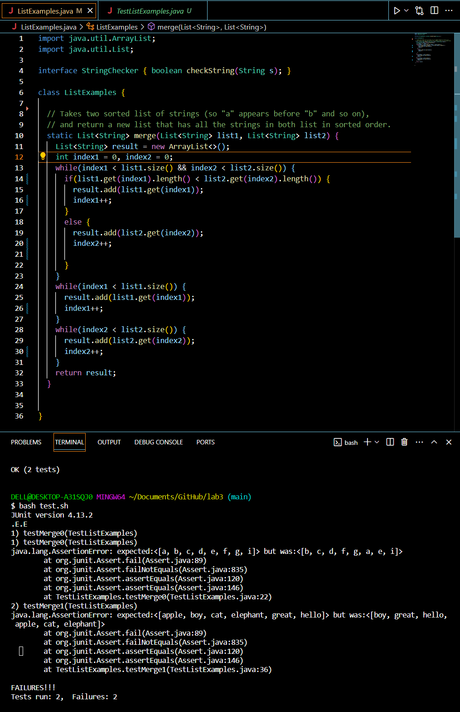
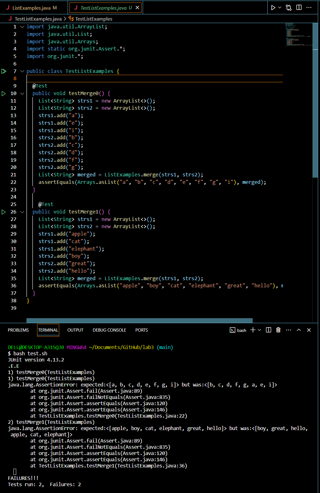

# Lab Report 5

## Part 1 - Debugging Scenario

**1. The original post on EdStem:**

Student(Sam): 

Hello guys, 
I have some issues with my code in a ```ListExamples.java``` class specifically in the merge method since it doesn't pass all of the tests on the test file ```TestListExamples.java```. I think the bugs might be in the if-conditional statement that I set in line #15, but I am not too sure if it will be the only thing that causes the errors. Other than this, I don't know how to set up other conditional statements to satisfy the requirements. Here are the screenshots showing a symptom on the terminal, along with the code in ```ListExamples.java``` and ```TestListExamples.java```.





**2. TA's response:**
Hi Sam,
You're right. I also think your code in line #15 might be the leading cause of the tests' failure. I suggest you develop a new if-conditional statement in line #15 again and repurpose the behavior of the merge method. I think the behavior in your merge method seems to be different from the requirements. Hence, it will produce a different output. Instead of comparing the length of the string within each element from each list, I recommend comparing the string values to maintain alphabetical order. Let me know if you have any further questions.

**3. Another screenshot/terminal output showing what information the student got from trying that, and a clear description of what the bug is**

Student's response: Ohh! I think I got what the overall behavior of the merge method is supposed to be. It intends to merge two lists and return a new list that has all the strings in both lists in sorted order, specifically in alphabetical order. In order to address the issue from my code, I just modified the if-conditional statement in line #15. In terms of the comparison logic, the correct comparison should be 
```list1.get(index1).compareTo(list2.get(index2)) < 0 ```. This would ensure that the strings from each list are compared based on their lexicographical order and, therefore, return one merged list containing all of the elements from two lists in sorted order.

Here's the screenshot of running the ```bash test.sh``` after fixing the bugs: 
.png)

It passes all the tests!


**4. At the end, all the information needed about the setup, including:**

**The file & directory structure needed:**

* ```/lib``` directory contains ```hamcrest-core-1.3.jar``` and ```junit-4.13.2.jar``` to run junit test
* ```ListExamples.java``` is the java class that contains the code for the ```merge``` function.
* ```test.sh``` is a bash script to run the tests in ```TestListExamples.java```
* ```TestListExamples.java``` is the java class that contains the test methods to test the ```merge``` function in ```ListExamples.java```

**The contents of each file before fixing the bug:**

Here's the contents of ListExamples.java before fixing the bug:
```
import java.util.ArrayList;
import java.util.List;

interface StringChecker { boolean checkString(String s); }

class ListExamples {

  // Takes two sorted list of strings (so "a" appears before "b" and so on),
  // and return a new list that has all the strings in both list in sorted order.
  static List<String> merge(List<String> list1, List<String> list2) {
    List<String> result = new ArrayList<>();
    int index1 = 0, index2 = 0;
    while(index1 < list1.size() && index2 < list2.size()) {
      if(list1.get(index1).length() < list2.get(index2).length()) {
        result.add(list1.get(index1));
        index1++;
      }
      else {
        result.add(list2.get(index2));
        index2++;

      }
    }
    while(index1 < list1.size()) {
      result.add(list1.get(index1));
      index1++;
    }
    while(index2 < list2.size()) {
      result.add(list2.get(index2));
      index2++;
    }
    return result;
  }


}
```

Here's the contents of TestListExamples.java

```
import java.util.ArrayList;
import java.util.List;
import java.util.Arrays;
import static org.junit.Assert.*;
import org.junit.*;

public class TestListExamples {

  @Test
  public void testMerge0() {
    List<String> strs1 = new ArrayList<>();
    List<String> strs2 = new ArrayList<>();
    strs1.add("a"); 
    strs1.add("e"); 
    strs1.add("i");
    strs2.add("b");
    strs2.add("c");
    strs2.add("d"); 
    strs2.add("f");
    strs2.add("g");  
    List<String> merged = ListExamples.merge(strs1, strs2);
    assertEquals(Arrays.asList("a", "b", "c", "d", "e", "f", "g", "i"), merged);
  }

    @Test
  public void testMerge1() {
    List<String> strs1 = new ArrayList<>();
    List<String> strs2 = new ArrayList<>();
    strs1.add("apple"); 
    strs1.add("cat"); 
    strs1.add("elephant");
    strs2.add("boy");
    strs2.add("great");
    strs2.add("hello");   
    List<String> merged = ListExamples.merge(strs1, strs2);
    assertEquals(Arrays.asList("apple", "boy", "cat", "elephant", "great", "hello"), merged);
  }
}
```
Here's the content of ```test.sh```

```
set -e

javac -cp ".;lib/hamcrest-core-1.3.jar;lib/junit-4.13.2.jar" *.java

java -cp ".;lib/junit-4.13.2.jar;lib/hamcrest-core-1.3.jar" org.junit.runner.JUnitCore TestListExamples

```
**The full command line (or lines) you ran to trigger the bug:**

```bash test.sh```

**A description of what to edit to fix the bug:**

To fix the bug above, we would need to understand the overall purpose of the merge function. Since it requires us to return a merged list that contains the elements from both lists in sorted order, we would need to repurpose the if-conditional statement in line #15 to fix the bug. Instead of comparing the size of each string within each element from the list, we should use the ```compareTo()``` method, which is part of the string class in Java. This method compares two strings lexicographically based on the Unicode value of each character in the strings. So, we are going to modify the if-conditional statement in line #15 to ```list1.get(index1).compareTo(list2.get(index2)) < 0```. The ```list1.get(index1).compareTo(list2.get(index2))``` would return the negative value if the string in list1 is lexicographically smaller than the the string in ```list2```. Therefore, if that comparison is less than 0, the element in ```list1``` will be added first. This would ensure that the merged list has the correct order of elements in an alphabetical order during the merging process. 

## Part 2 - Reflection
A couple of things from my lab experience in the second half of this quarter that I didn't know before is creating a grading script to auto-grade student programming assignments. I have wondered how those things work behind the scenes ever since I took the introductory Java course. I am now able to write a grading script for programming assignments by myself and even know some useful commands like ```find``` , ```grep```, ```less``` that help facilitate the grading process in counting and finding the student file submissions.
